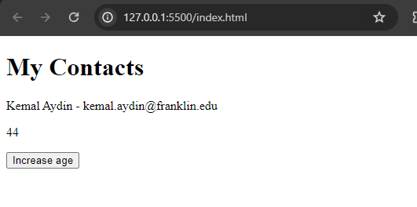
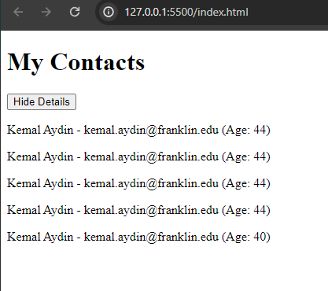
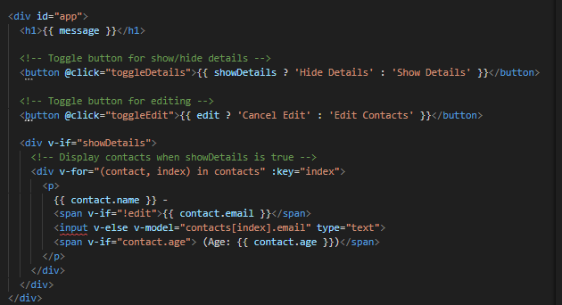

# Homework-6
You have the template for a simple contact list running with Vue.
Check the index.html and look for the .
"vue@next" is used for accessing the latest Vue version.

1. Create a toggle button for showing and hiding details of the contacts. https://vuejs.org/v2/guide/events.html#Listening-to-Events

2. You may check the button in the code <button @click="contacts[0].age++">Increase age</button> and use a similar one for showing and hiding contact details.

3. Please check app.js and see the field showDetails which is set to false. Use that field and update it for toggle function.

4. Open index.html and use v-show directive to show details for the contacts. (https://vuejs.org/v2/guide/conditional.html#v-show)
5. You may achieve the same results using v-if directive. Check the documentation and explain when you would use v-show instead of v-if.
6. I would use v-show when ...
I anticipate frequent toggling of visibility, especially in scenarios where the condition changes rapidly or multiple times in a short period. v-show uses CSS to toggle visibility without affecting the DOM structure, which can offer better performance compared to v-if in such cases
7. Right now the app is showing only one contact. Please update the index.html to show all the contacts. (Hint: https://vuejs.org/v2/guide/list.html#v-for-with-an-Object)

8. You may use the contacts from homework 5 and add an "age" field for all contacts.
9. You can use the v-model directive to create two-way data bindings and update select elements. https://vuejs.org/v2/guide/forms.html
10. Please bind contact emails to a text input so you can update them.

11. Create a toggle button for turning editing ON and OFF similar to the show/hide details button. 

# hw-6

